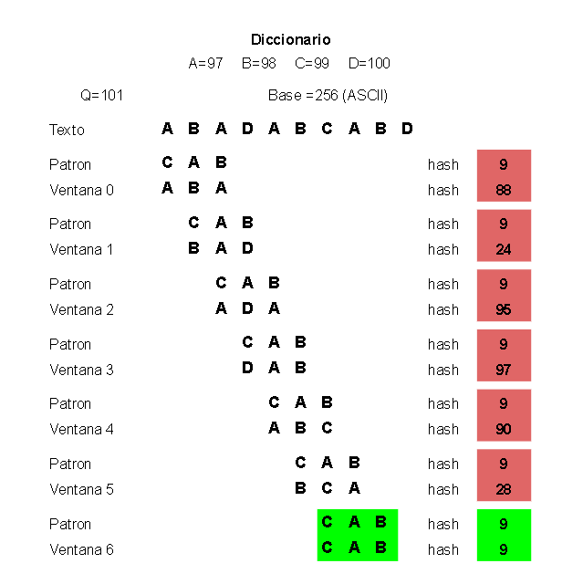

Introducción
============

Algoritmos String Matching
--------------------------

Algoritmos de String Matching, también conocidos como algoritmos de emparejamiento de secuencias, son herramientas esenciales para la búsqueda eficiente de un patrón dentro de un texto. Este conjunto de algoritmos desempeña un papel fundamental en diversas aplicaciones, como la búsqueda de patrones en secuencias de ADN, la comparación de textos, los motores de búsqueda en la web y la búsqueda de patrones en grandes volúmenes de datos, entre otras aplicaciones.

Michael Oser Rabin y Richard Manning Karp
-----------------------------------------

En 1987, Michael Oser Rabin y Richard Manning Karp presentan el algoritmo Rabin-Karp, una solución revolucionaria para el desafío de encontrar subcadenas en textos extensos. Su enfoque se basó en el uso de funciones hash para agilizar el proceso: calculado rápidamente el hash de las subcadenas del texto y comparándolo con el hash del patrón que buscaban. Esta estrategia permite una búsqueda eficiente y rápida de patrones en textos largos, marcando un hito significativo en el campo de los algoritmos de búsqueda de cadenas.

Proyecto
--------

  
La finalidad del proyecto es la aplicación del algoritmo en un sistema de búsqueda de libros para una biblioteca.Pudiendo así reconocer si el registro correspondiente a un libro contiene una palabra que será especificada por el usuario. Además se implementaron servicios relacionados , así como también una implementación del algoritmo Rabin-Karp que muestra al usuario el paso a paso seguido por el algoritmo, pudiendo de esta forma ser más fácil de entender el funcionamiento del mismo.

Decisiones de diseño
====================

En las decisiones de diseño, se eligió implementar la programación orientada a objetos, posibilitando la implementación de interfaces y herencia para lograr polimorfismo. Esto abre la puerta a la opción de incorporar otros algoritmos de String matching.

Clases
======

Buscador
--------

Se decidió hacer uso de una clase abstracta de buscador.  
Contiene el método contienePatron(patron, texto)  puramente virtual , haciendo de esta forma que deba ser implementada en su herencia.  
El objetivo de esto es brindar la posibilidad de expansión del código en un futuro , pudiendo así agregar nuevos algoritmos de string matching  sin necesidad de modificar todo el código existente.

RobinKarp
---------

Esta clase implementa el algoritmo de búsqueda de forma separada, permitiendo  no solo modularizar el código sino también  posibilitando la reutilización.  
Cuenta con 2 atributos ,  base ynumprimo los cuales se  utilizan en el algoritmo.  
Sus métodos son:

* contienePatron(patron, texto) : Implementación de la búsqueda  de un patrón en un texto utilizando el algoritmo de Rabin-Karp.
* encontrarPatronPasoPaso(patron, texto) :contiene el mismo funcionamiento del método anterior .Además incluye comentarios los cuales son impresos en la línea de comando que guían paso a paso cómo funciona el algoritmo , posibilitando el estudio del mismo.

  
Libro
--------

La implementación del objeto libro corresponde a características reales que describen de forma abstracta un libro.  
La clase Libro tiene los atributos:

* ID : Número de identificación .
* N° Estanteria :  Estantería en la cual se encuentra el libro.
* N° Estante : Estante de la estantería en el cual se encuentra el libro .
* Titulo: Titulo o nombre del libro .
* Autor : Nombre o apellido del autor del libro.
* Editorial : Editorial del libro.
* Genero : Genero principal del libro.
* SubGenero : Subgénero y palabras claves por las que pudiera ser buscado ese libro.

Los métodos principales de esta clase son :

* impLibro() : Permite imprimir en la consola de comando todos los atributos del libro.
* buscarPalabra() : Este método permite  que un libro pueda responder si contiene una palabra entre sus atributos , de esta forma en sus parámetros recibe un String  con la palabra que se desea buscar, recibe un objeto Buscador el cual implementa el algoritmo para ver si la palabra buscada se encuentra dentro de los atributos.También puede recibir booleanos para definir por cuales de sus atributos deberá buscar y por cuáles no , por defecto en caso de sólo recibir un String  y el Buscador  buscará la palabra en todos los atributos.  
    

* * *

Servicios
=========

En la clase Main se implementó un menú el cual ofrece el uso de distintos servicios:

Servicio 1

Este servicio muestra la lista completa de libros cargados, la carga de estos libros se realizó de forma estática dentro del main.

Servicio 2

El servicio 2 provee la posibilidad de realizar búsquedas básicas, esto significa que buscará en todos los campos del libro la palabra especificada por el usuario.  
Luego de realizada la búsqueda, se mostrará en pantalla una lista de los libros en los cuales aparezca la palabra especificada por el usuario.

Servicio 3

El servicio 3 de búsqueda avanzada le provee al usuario la posibilidad de definir los campos de la búsqueda.  
De igual manera que en el servicio 2,  una vez realizada la búsqueda estos serán mostrados en pantalla.

Servicio 4

En el servicio 4 el usuario es capaz ingresar el texto y el patrón que desea buscar.  
Luego se mostrará en pantalla  el detalle paso a paso de los cálculos que realiza el algoritmo, así como también el patrón  y la información correspondiente a la ventana actual.  

* * *

Algoritmo Rabin-Karp
====================

El algoritmo de Rabin-Karp se basa en nociones elementales de la teoría de números, tal como la equivalencia de dos números módulo un tercero (Cormen et al., 2009). Su eficiencia radica en la comparación de los valores hash de dos cadenas, esto se puede hacer en tiempo lineal y es mucho más eficiente que comparar los caracteres individuales de las cadenas..  
Para esto, el algoritmo de Rabin-Karp utiliza una técnica conocida como Rolling Hash. Esta estrategia implica calcular un hash utilizando los valores de cada carácter, que se denomina ventana de hash. Posteriormente, la ventana se desplaza iterativamente hacia adelante, eliminando el primer carácter y agregando el siguiente. De esta manera, se calcula el hash del siguiente subconjunto, reutilizando los valores previamente calculados en el paso anterior. Este proceso, conocido como mover la ventana de hash, simplifica la tarea de calcular los hash de todas las posibles subcadenas.  

1.  Calcula el hash del patrón y el hash de un subsegmento del texto el cual es del mismo tamaño.
2.  Compara el hash de la subcadena de texto con el hash del patrón.
3.  Si coinciden, compara los caracteres individuales para asegurarse de que las dos cadenas coinciden exactamente.
4.  Si no coinciden, desliza la ventana de la subcadena aumentando el índice y se repite el paso 2.  
    

El algoritmo es tan bueno como su función hash. Si se utiliza una función hash que da como resultado muchos falsos positivos, entonces se harán comparaciones de caracteres con demasiada frecuencia como para considerar que este método es más eficaz que un enfoque ingenuo.

  

Polinomio Rolling Hash
----------------------

Podemos calcular el hash polinomial con multiplicaciones y adiciones como se muestra a continuación.

c = caracteres en la cadena m = longitud de la cadena b = constante

Por lo tanto, podemos calcular el hash de la nueva ventana usando la ecuación que se muestra a continuación.

  
Hp = hash anterior Cp = carácter anterior Cn = carácter nuevo m = tamaño de la ventana b = constante

Para evitar manipular valores Hgrandes y desbordamientos de enteros estas cuentas se hacen en base al módulo Q  , el cual debe ser un número primo .  

Mientras menor sea el valor de Q, mayores serán las posibilidades de que dos cadenas diferentes tengan el mismo hash resultando en falsos positivos.

Método de Horner
----------------

El método de Horner simplificará polinomios dividiéndolos en monomios.

Ejemplo con el método de Horner
-------------------------------

Tomaremos de ejemplo el patrónABCen el texto ABABCAB .  
El algoritmo Rabin-Karp primero calcula el largo del patrón en el cual buscamos.

Luego dentro del primer For se calcula el hash del Patrón , así también como el de la primera ventana usando el método de Horner.

  
Como podemos ver en las siguientes imágenes cada letra tiene un valor en la tabla de ASCII pero contribuye de forma distinta de acuerdo a su ubicación.

  

  

En el siguiente fragmento de código se calcula el valor “H” el cual será utilizado para realizar el cálculo del desplazamiento .

El siguiente  bloque de código realiza la búsqueda del patrón en el texto.  
Primero compara los valores del Hash del patrón y del Hash de la ventana  y si son iguales compara letra a letra para verificar la coincidencia exacta.

  
En caso de que el patrón no haya sido encontrado entonces la ventana se mueve una posición , calculando el nuevo hash y volviendo al principio del bucle.  
  
Continuando con el mismo ejemplo podemos ver  la primera ventana .  
En la que el hash del patrón tiene valor 11 y el hash de la ventana valor 9 .

Luego en el primer desplazamiento.

En la nueva ventana se calcula el hash igual a 4 como podemos ver en la siguiente imagen.

Al no coincidir con el hash del patrón  se procede  al Segundo desplazamiento.

En la nueva ventana se calcula el hash igual a 11 como podemos ver en la siguiente imagen.

Luego del desplazamiento  el Hash del patrón y el Hash de la ventana coinciden en valor .Por lo tanto se procede a comparar si ambas cadenas son iguales.  

* * *

* * *

Alternativas
============

Entre las alternativas posibles para la resolución del problema contamos con

* Algoritmo ingenuo o fuerza bruta: No realiza Preprocesamiento.
* Autómata finito: Realiza un preprocesamiento del patrón para generar un autómata finito determinístico con el que luego procesa la información del texto.
* Knuth-Morris-Pratt: Preprocesa el patrón generando una tabla de valores con la que luego usa para saltar caracteres. Eficiente en textos largos con repetición de subpatrones.
* Boyer-Moore :Hace un preprocesamiento del patrón a fin de poder saltar caracteres en el texto usando reglas de salto.  
    

|     |     |     |
| --- | --- | --- |
| Algoritmo | Tiempo de Procesamiento | Tiempo de Búsqueda |
| Ingenuo (Naive) | 0   | O((n-m+1)m) |
| Rabin-Karp | O(m) | O((n-m+1)m) |
| Automata Finito | O(m^3 \| \|) | O(n) |
| Knuth-Morris-Pratt | O(m) | O(n) |
| Boyer-Moore | O(m) | O(n) |

A continuación, se presenta una comparativa del rendimiento del algoritmo Rabin-Karp en relación con otros algoritmos. Con variaciones de tamaño del patrón y tamaño del alfabeto.

  
Resultado de un patrón corto en el genoma de E. coli.   
Resultados de un patrón corto en un texto en inglés.  

Resultados para patrón corto en alfabeto binario.

* * *

Resultados del patrón largo en el genoma de E. coli.

Resultado de un patrón largo en un texto en inglés.  

Resultado de un patrón largo en un alfabeto binario.  

Por otro lado también podemos observar el comportamiento al variar el número primo Q usando el mismo texto y patrón. Obteniendo menos colisiones al aumentar Q.

  

  

Búsquedas de múltiples patrones
===============================

  
A comparación de otros algoritmos que son más eficientes en la búsqueda de un patrón, el algoritmo Rabin-Karp puede ser modificado para permitir la comparación de múltiples patrones con un mismo texto.

Por ejemplo, veremos cómo podríamos modificarlo de forma sencilla para permitir la búsqueda de múltiples patrones de igual tamaño.

Explicación:

La función recibe un string de texto y un array de strings de patrones.

1.  Se crea un array de duplas que almacenará cada patrón junto con su hash.
2.  Por cada patrón en el array de patrones, se calcula su hash y se guarda en el array de duplas.
3.  Se calcula el hash de la primera ventana del texto, que es un subsegmento del tamaño de un patrón.
4.  Se itera sobre cada índice del texto hasta el penúltimo índice posible.

1.  Se compara el hash de la ventana actual con el hash de cada patrón en el array de duplas.

1.  Si los hashes coinciden, se compara caracter a caracter para asegurar una coincidencia exacta y se informa si se encuentra un patrón.

2.  Se calcula el hash de la próxima ventana deslizando la ventana hacia la derecha una posición.

  

Desventajas
===========

El algoritmo Rabin-Karp presenta desventajas en comparación con otros algoritmos simples de búsqueda de cadenas. Su complejidad en el peor de los casos es equivalente a la de una búsqueda por fuerza bruta. Esto se debe al uso de un número primo Q, en el cálculo del hash mediante el método de Horner. La elección de este número primo permite reducir los valores del hash para evitar desbordamientos, pero también disminuye las posibles combinaciones de hashes, lo que puede llevar a colisiones. Es decir, dos secuencias de caracteres diferentes pueden tener valores de hash diferentes con el método de Horner, pero compartir el mismo valor al realizar el módulo Q. En este escenario, se produce una colisión que requiere una comparación caracter por caracter. Por lo tanto, la selección de un número primo grande para Q es crucial para maximizar la cantidad posible de hashes y minimizar las colisiones. En resumen, la eficacia del algoritmo depende en gran medida de la calidad del cálculo del hash y de la cantidad de posibles hashes que pueda generar.

Ventajas
========

El algoritmo Rabin-Karp presenta ventajas significativas, especialmente en la búsqueda de múltiples patrones, gracias a su implementación sencilla. Aunque su complejidad en el peor de los casos es similar a la búsqueda por fuerza bruta (O(n*m)), con una buena función de hash y un número primo lo suficientemente grande, puede evitar colisiones, lo que resulta en un rendimiento promedio de O(n+m) por lo cual se dice que es un buen algoritmo para textos largos. Esta capacidad de comparación de múltiples patrones lo hace muy útil en una variedad de campos.

Aplicaciones del algoritmo en otros campos
==========================================

Ciberseguridad
--------------

Este campo nació en 1978 en el estado de Florida cuando se reconocieron como crímenes los casos de modificación de datos, copyright, sabotaje y ataques similares.

Aunque el algoritmo Rabin-karp es un algoritmo de reconocimiento de patrones en firmas digitales, presentado para aplicarse en el campo de la criptografía, es muy útil en el campo de la informática forense. El hecho de poder encontrar similitud entre subcadenas fue un aporte importante en las técnicas forenses. El algoritmo Karp­-Rabin fue un precursor del rolling hash usado luego en algoritmos derivados esta idea para encontrar similitud entre binarios , por ejemplo los algoritmo SSDeep, SSDC y SDHash. Con la idea de encontrar patrones maliciosos conocidos dentro de ficheros.

Detección del plagio
--------------------

La primera ley de derechos de autor del mundo fue el Estatuto de la Reina Ana, promulgado en 1710 por el parlamento británico. Esta ley fue la primera en otorgar protección jurídica a las obras escritas y se considera el origen del copyright. El plagio se trata de una acción desleal que vulnera el derecho de autor.

Dadas las características del algoritmo Rabin-Karp de búsqueda de múltiples patrones, esto permite la comparación de 2 textos. Por ejemplo, pensémoslo como si uno de los textos se dividiera en N patrones los cuales serán buscados dentro del segundo texto. Esta es una forma simplificada de cómo podríamos ver la utilidad del algoritmo en la detección de plagio, lo cual tiene aplicación en el ámbito artístico, literario, académico, la industria del software,  entre otros.

* * *

Conclusión
==========

Dentro de las ventajas y desventajas del algoritmo Rabin-Karp podemos apreciar en su funcionamiento el uso del hash . Dependiendo de la forma en la que sea calculado este mismo podrá traer mejor o peor desempeño al disminuir o aumentar las colisiones de hash.  
  
El algoritmo Rabin-Karp ha servido de inspiración para la creación de otros algoritmos que también hacen uso del rolling hash, sus variantes pueden ser aplicadas en múltiples campos.  

  
En términos de rendimiento, el algoritmo Rabin-Karp supera a la fuerza bruta, pero queda por debajo de los algoritmos Knuth-Morris-Pratt y Boyer-Moore. Sin embargo, el algoritmo es fácilmente adaptable para búsqueda de múltiples patrones de igual longitud destacando como la mejor opción entre las alternativas mencionadas anteriormente.

Bibliografía
============

* Introduction to Algorithms, 3rd Edition (The MIT Press) Páginas \[985 - 1011\] Thomas H. Cormen, Charles E. Leiserson, Ronald L. Rivest, Clifford Stein

* Técnicas fuzzy y minería de datos para detectar malware ( Universidad politécnica de Fabra-Barcelona) Daniel Bonhomme Iglesias  

* Fast string matching algorithm (Department of Computer Science Jordan University of science and Technology ) Ala’a Al-Howaide, Wail Mardini*, Yaser Khamayseh, Muneer Bani Yasin
